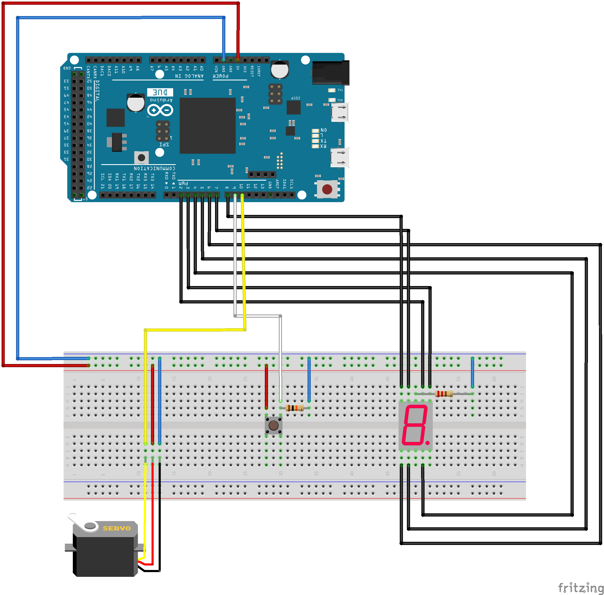
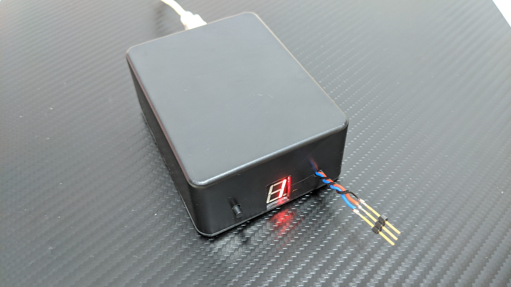

# Baby Mobile

```
這是為了我女兒而建立的 Side Project ，這次的主題是床邊旋轉吊飾裝置，可以刺激寶寶的視覺，訓練眼球的動態捕捉能力。
```

## 電路設計

### 電路材料

1. Arduino Diecimila 控制板
2. 七段顯示器
3. 220Ω 電阻 (紅紅棕)
4. 按鈕開關
5. 1KΩ 電阻 (棕黑橙)
6. SG90 360度 伺服馬達

### 電路圖



## 主體設計

### 使用材料

1. 塑膠盒
2. 螺絲
3. 木板

### 內部圖


### 外觀圖

