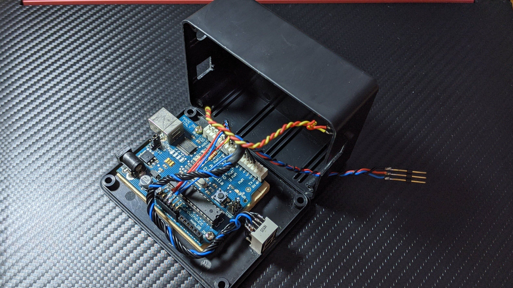

# Baby Mobile (English)

> This is the Side Project I created for my daughter. This topic is the bedside rotating pendant device, which can stimulate the baby's vision and train the eyeball dynamic capture ability.

## Use Case

## Software Description

> Click the button to switch modes in sequence.

### Rotation mode

* [No display] Stop rotating
* [Number 1] Sine wave
* [Number 2] Sawtooth
* [Number 3] Triangle wave
* [Number 4] Curvy triangle wave
* [Number 5] Square wave
* [Number 6] Trapezoidal wave
* [English R] Random wave

### Memory use

Sketch uses 6974 bytes (48%) of program storage space. Maximum is 14336 bytes.
Global variables use 417 bytes (40%) of dynamic memory, leaving 607 bytes for local variables. Maximum is 1024 bytes.

## Circuit Design

### Circuit material

1. Arduino Diecimila control panel
2. Seven segment display
3. 220Ω Resistance (red-red-brown)
4. Push button
5. 1KΩ Resistance (brown-black-orange)
6. SG90 360 degree Servo Motor

### Circuit diagram

## Main Body Making

> Through the draft design and simple cutting and digging, and fixing the board and the parts to the main body.

### Materials used

1. Plastic box
2. Screw
3. Wood board
4. Wire
5. Connector

### Internal photo

### External photo

---

# 寶寶吊飾 (中文)

> 這是為了我女兒而建立的 Side Project ，這次的主題是床邊旋轉吊飾裝置，可以刺激寶寶的視覺，訓練眼球的動態捕捉能力。

## 使用情形

## 軟體說明

> 單擊按鈕即可依序切換模式。

### 旋轉模式

* [無顯示] 停止旋轉
* [數字1] 正弦波
* [數字2] 鋸齒波
* [數字3] 三角波
* [數字4] 彎曲的三角波
* [數字5] 方波
* [數字6] 梯形波
* [英文R] 隨機波形

### 記憶體占用

* 草稿碼使用了 6974 bytes (48%) 的程式儲存空間。上限為 14336 bytes。
* 全域變數使用了 417 bytes (40%) 的動態記憶體，剩餘 607 bytes 給區域變數。上限為 1024 bytes 。

## 電路設計

### 電路材料

1. Arduino Diecimila 控制板
2. 七段顯示器
3. 220Ω 電阻 (紅紅棕)
4. 按鈕開關
5. 1KΩ 電阻 (棕黑橙)
6. SG90 360度 伺服馬達

### 電路圖

## 主體製作

> 透過草稿設計及簡單的裁切挖洞，並將木板鎖上、零件黏合於主體。

### 使用材料

1. 塑膠盒
2. 螺絲
3. 木板
4. 電線
5. 連接器

### 內部圖

### 外觀圖

## 備註

> 七段顯示器應該每個腳位都加上一顆 220Ω 電阻，但因為我現有的材料不足所以只放了一顆共用，所幸全亮時還足夠驅動所以影響不大。
